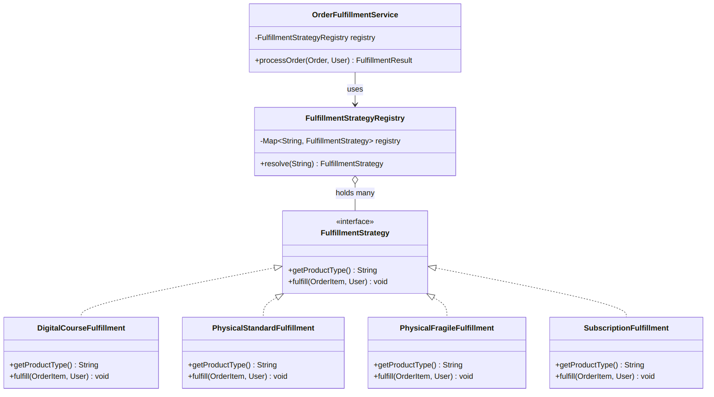
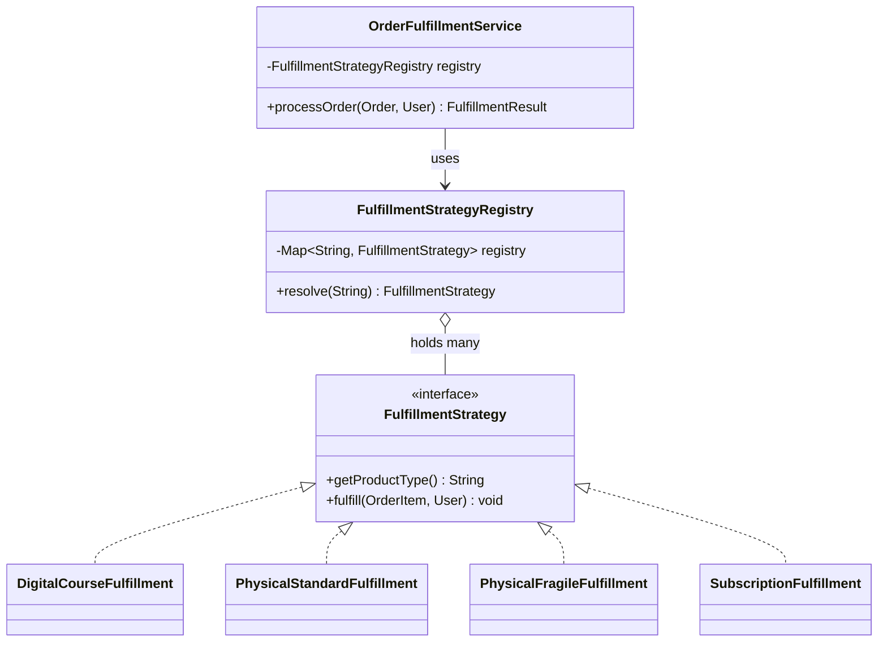
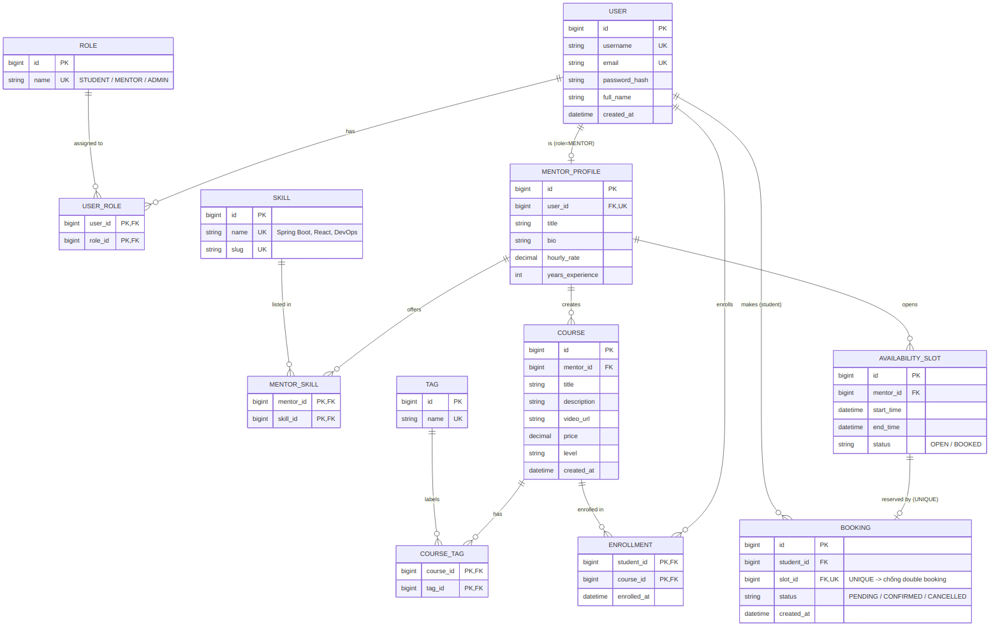
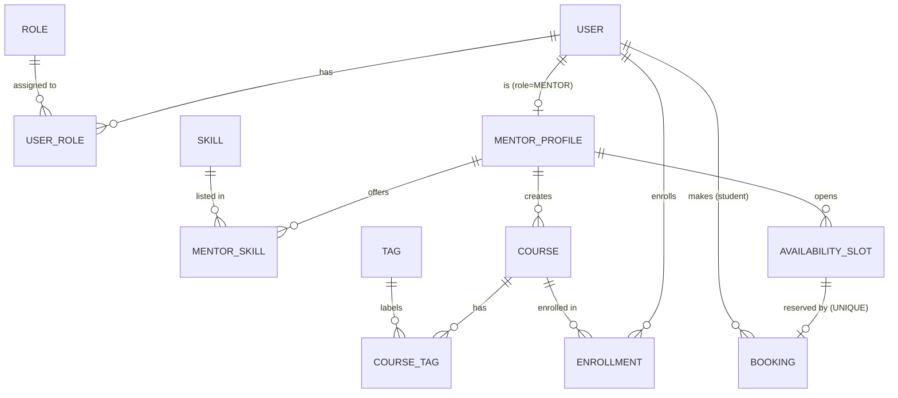
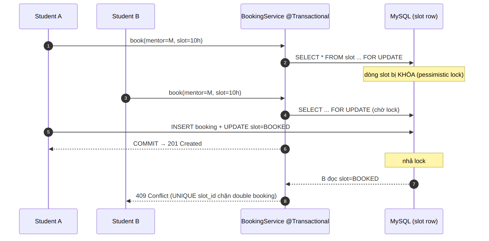

# Hackathon AI Application in Action — Đề 007

> **Sinh viên:** Hoàng Văn Chung — **Lớp:** CNTT1 — **Mã đề:** DE007
> Repo mẫu: `RE12345_NguyenVanA_Hackathon_AI_DE007`
> _Nhớ đổi tên repo / thư mục gốc theo cú pháp `[Tên lớp]_[Họ Tên]_[Mã đề]` trước khi nộp._

Tài liệu gồm: **Mục tiêu kỹ thuật**, **Lịch sử Prompt (Prompt Chain dạng log)** và **Phân tích lỗi AI** cho cả 3 phần, kèm sơ đồ kiến trúc, UML và ảnh chạy thực tế.

---

## 0. Bảng Mapping: Yêu cầu đề ↔ Giải pháp

| # | Yêu cầu của đề | Khái niệm/Kỹ thuật | Giải pháp trong repo | Vị trí |
|---|---|---|---|---|
| 1 | Thêm loại sản phẩm không sửa lõi | **Open/Closed Principle** | **Strategy Pattern** + Registry | `src/main/java/fulfillment/` |
| 2 | Bắt lỗi ràng buộc tập trung | **AOP** | `@RestControllerAdvice` + `@ExceptionHandler` | `src/main/java/exception/` |
| 3 | Không lộ stack trace DB | Information disclosure | JSON lỗi đồng nhất, ẩn message gốc | `GlobalExceptionHandler` |
| 4 | Skills/Tags không dùng mảng | **Database Normalization** | Bảng nối M:N (`MENTOR_SKILL`, `COURSE_TAG`) | `docs/erd_diagram.png` |
| 5 | Tìm kiếm động | Indexing | Bảng chuẩn hóa + index trên cột tìm kiếm | Phần 3 |
| 6 | Chống Double Booking | **Transaction + Isolation + Lock** | UNIQUE(slot_id) + `SELECT … FOR UPDATE` / `@Version` | Phần 3.4 |

---

## Cấu trúc thư mục

```
.
├── pom.xml               # Spring Boot 3.2 (Maven)
├── src
│   └── main
│       └── java
│           ├── fulfillment        # Phần 1 — Strategy Pattern (đã verify chạy được)
│           └── exception          # Phần 2 — @RestControllerAdvice xử lý lỗi tập trung
├── docs
│   ├── erd_diagram.png            # ERD (Phần 3)
│   ├── erd_diagram.mmd            # nguồn ERD (Mermaid)
│   ├── part1_class_diagram.png    # UML class diagram
│   └── part3_booking_sequence.png # sequence chống double booking
├── README.md
└── .gitignore
```

---

# PHẦN 1 — Tái cấu trúc Fulfillment (Open/Closed Principle)

## 1.1. Mục tiêu kỹ thuật
- **Vấn đề:** `processOrder()` dùng chuỗi `if/else` theo `productType`. Mỗi loại sản phẩm mới ⇒ phải sửa vòng lặp lõi ⇒ vi phạm **Open/Closed Principle (OCP)** và **Single Responsibility (SRP)**.
- **Giải pháp:** **Strategy Pattern** + **Registry** ánh xạ `productType → strategy`. Service chỉ tra registry rồi `delegate`, không chứa logic riêng của loại nào. Thêm `SUBSCRIPTION_SERVICE` chỉ cần tạo 1 class + đăng ký, **không sửa** service ⇒ thoả OCP.

## 1.2. Sơ đồ kiến trúc & UML

**UML Class Diagram (Strategy Pattern):**



<details><summary>Mã Mermaid của Class Diagram</summary>


</details>

## 1.3. Lịch sử Prompt (Prompt Chain — log làm việc với AI)

**🧑 Prompt 1 — Chẩn đoán & chọn pattern**
> "Đây là class `OrderFulfillmentService` dùng chuỗi if/else theo productType (dán code). Hãy chỉ ra nó vi phạm nguyên tắc SOLID nào và đề xuất design pattern phù hợp để mỗi lần thêm loại sản phẩm mới không phải sửa vòng lặp lõi."

**🤖 AI trả lời (tóm tắt):**
> - Vi phạm **OCP** (sửa code cũ mỗi lần mở rộng) và **SRP** (1 hàm ôm logic của mọi loại).
> - Đề xuất **Strategy Pattern**: tách mỗi nhánh thành 1 class chiến lược riêng, service ủy quyền cho chiến lược tương ứng.

**🧑 Prompt 2 — Sinh khung Strategy**
> "Áp dụng Strategy Pattern: tạo interface `FulfillmentStrategy` với `getProductType()` và `fulfill(OrderItem, User)`, tách 3 nhánh hiện tại thành 3 class strategy, giữ nguyên các dòng `System.out.println` gốc."

**🤖 AI trả lời (tóm tắt):**
> Sinh interface + 3 class `DigitalCourseFulfillment`, `PhysicalStandardFulfillment`, `PhysicalFragileFulfillment`. **Nhưng** vẫn để service dùng `switch(type)` để `new` strategy → *(xem mục 1.4, đây là điểm chưa tối ưu)*.

**🧑 Prompt 3 — Bỏ if/else khỏi service bằng Registry**
> "Đừng để service tự switch-case chọn strategy. Thiết kế `FulfillmentStrategyRegistry` dạng `Map<String,FulfillmentStrategy>` build từ `List` strategy (kiểu Spring inject List). Viết lại `processOrder` sao cho vòng lặp lõi không còn biết productType cụ thể."

**🤖 AI trả lời (tóm tắt):**
> Tạo registry dùng `Collectors.toMap(getProductType, identity)`; `processOrder` chỉ gọi `registry.resolve(type).fulfill(...)`. Lõi không còn tham chiếu loại sản phẩm nào.

**🧑 Prompt 4 — Chứng minh OCP + demo chạy được**
> "Thêm loại mới `SUBSCRIPTION_SERVICE` để chứng minh không phải sửa service. Viết class `Demo` có `main()` tạo đơn 4 item và in kết quả để mình verify."

**🤖 AI trả lời (tóm tắt):**
> Thêm `SubscriptionFulfillment` + `Demo`. Xác nhận: chỉ thêm 1 bean, service/registry **không đổi**.

**🧑 Prompt 5 — Hardening**
> "Thêm fail-fast: trùng productType thì ném lỗi ngay khi build registry; type không tồn tại thì `IllegalArgumentException` rõ ràng."

## 1.4. Phân tích lỗi AI
- **Lỗi lần sinh đầu:** AI vẫn để **logic chọn strategy nằm trong service** dưới dạng `switch(type)` để `new`. Như vậy lõi **vẫn phải sửa** khi thêm loại mới ⇒ chưa thật sự thoả OCP (chỉ đổi if/else "thực thi" thành if/else "chọn lựa").
- **Khắc phục (Prompt 3):** ép AI tách phần ánh xạ ra **Registry** build từ `List<FulfillmentStrategy>`. Service hết tham chiếu productType cụ thể; thêm loại mới = thêm 1 bean.
- **Lỗi phụ:** AI giữ `throw new RuntimeException(...)` chung chung → đã đổi sang exception đúng ngữ nghĩa (`IllegalStateException`, `IllegalArgumentException`).

## 1.5. Kết quả chạy (đã verify)
Môi trường chỉ có JRE (không `javac`) nên dùng **single-file source launcher** Java 21 để chạy thử logic. Output thực tế:

```
Granting access to course ID: COURSE-SPRING-101
Sending email with login credentials to student@edumentor.vn
Generating shipping label for standard delivery...
Deducting inventory in warehouse for item: BOOK-CLEAN-CODE
Applying special bubble wrap packaging...
Booking specialized fragile courier for item: VASE-CERAMIC
Adding extra shipping insurance...
Activating subscription plan: PRO-MONTHLY
Scheduling recurring billing cycle for student@edumentor.vn
Sending welcome onboarding email...
Order status : FULFILLED
Result       : FulfillmentResult{orderId='ORD-1001', status='SUCCESS'}
```

> Dòng `Activating subscription plan…` chứng minh loại **MỚI** chạy được mà `OrderFulfillmentService` không hề bị sửa.
> Chạy bản đóng gói chuẩn (cần JDK): `cd src\main\java && javac fulfillment\*.java && java fulfillment.Demo`

---

# PHẦN 2 — Xử lý lỗi tập trung (Spring Data JPA + AOP)

## 2.1. Mục tiêu kỹ thuật & Root Cause
- **Root cause:** Vi phạm `UNIQUE` → Hibernate ném `SQLIntegrityConstraintViolationException`, Spring dịch thành `DataIntegrityViolationException`. Vì **không ai bắt**, nó nổi lên `DispatcherServlet` ⇒ Spring trả mặc định **HTTP 500** kèm stack trace ⇒ **lộ tên bảng/constraint** (`uk_user_email`) — lỗ hổng **information disclosure**.
- **Giải pháp (AOP):** `@RestControllerAdvice` bắt lỗi **tập trung**, trả **409 Conflict** + JSON đồng nhất; thêm handler validation (→400) và lưới an toàn `Exception` (→500 không lộ chi tiết).

## 2.2. Sơ đồ luồng xử lý lỗi (AOP)

`@RestControllerAdvice` đóng vai trò **advice** cắt ngang mọi `@RestController`: exception cứ "nổi lên" và bị chặn tại một điểm duy nhất trước khi tới client.

## 2.3. Tại sao KHÔNG nên bọc try-catch rải rác ở mọi `save()`?
1. **Cross-cutting concern:** "Dịch lỗi DB → HTTP response" lặp ở mọi service ⇒ try-catch khắp nơi vi phạm **DRY**, trộn lẫn nghiệp vụ với hạ tầng.
2. **Dễ sót & thiếu nhất quán:** Quên một `save()` là lại rò 500; mỗi nơi format JSON khác nhau ⇒ response không đồng nhất.
3. **Sai tầng kiến trúc:** Service không nên biết `HttpStatus`/`ResponseEntity`; việc map exception → mã HTTP thuộc tầng web.
4. **`@RestControllerAdvice` chính là AOP:** thêm/sửa quy tắc lỗi chỉ ở 1 file; service giữ được sự "mỏng" — cứ để exception **nổi lên** (fail-fast) cho advice lo.

## 2.4. Lịch sử Prompt (Prompt Chain — log)

**🧑 Prompt 1 — Điều tra Root Cause**
> "Spring Boot + JPA + MySQL, email/username có UNIQUE. Đăng ký trùng email trả HTTP 500 kèm stack trace (dán log `DataIntegrityViolationException … constraint [uk_user_email]`). Giải thích chuỗi exception DB → Hibernate → Spring và vì sao ra 500."

**🤖 AI trả lời (tóm tắt):**
> `SQLIntegrityConstraintViolationException` (JDBC) → `ConstraintViolationException` (Hibernate) → `DataIntegrityViolationException` (Spring). Không handler nào bắt ⇒ về `DispatcherServlet` ⇒ 500 + stack trace.

**🧑 Prompt 2 — Đề xuất hướng AOP**
> "Mình muốn xử lý tập trung, không try-catch từng service. Hướng dẫn dùng `@RestControllerAdvice` + `@ExceptionHandler` để bắt `DataIntegrityViolationException`, trả 409 với JSON `{\"error\":\"DUPLICATE_DATA\",\"message\":\"...\"}`."

**🤖 AI trả lời (tóm tắt):**
> Sinh `GlobalExceptionHandler` với `@ExceptionHandler(DataIntegrityViolationException.class)` trả `ResponseEntity` 409.

**🧑 Prompt 3 — Sinh code đầy đủ**
> "Viết `GlobalExceptionHandler` + DTO `ErrorResponse` (error, message, status, path, timestamp), thêm handler validation 400 và fallback 500 không lộ chi tiết."

**🤖 AI trả lời (tóm tắt):**
> Sinh đủ 3 handler + DTO. **Nhưng** lấy `ex.getMessage()` (chứa tên bảng) nhét thẳng vào `message` → *(xem 2.5)*.

**🧑 Prompt 4 — Thông báo cụ thể nhưng an toàn**
> "Phân biệt trùng email vs username để báo cho user, nhưng tuyệt đối không in message gốc của DB ra ngoài. Gợi ý cách đọc tên constraint an toàn."

**🤖 AI trả lời (tóm tắt):**
> Dùng `getMostSpecificCause()` chỉ để **dò keyword** (`uk_user_email`/`uk_user_username`) rồi map sang thông báo tiếng Việt mình kiểm soát; message gốc chỉ ghi log nội bộ.

**🧑 Prompt 5 — Lập luận phản biện**
> "Viết lập luận vì sao KHÔNG nên rải try-catch ở mọi `save()`, gắn với cross-cutting concern và AOP."

## 2.5. Phân tích lỗi AI
- **Lỗi lần sinh đầu:** AI lấy `ex.getMessage()` (chứa tên bảng + constraint) **nhét thẳng** vào field trả client ⇒ **vẫn lộ cấu trúc DB** — đúng lỗ hổng đề muốn vá!
- **Khắc phục (Prompt 4):** không trả message gốc; chỉ dò keyword constraint để map thông báo an toàn; message gốc ghi log nội bộ.
- **Lỗi phụ:** AI đặt `@ExceptionHandler(Exception.class)` trước handler cụ thể (có thể "nuốt" lỗi cụ thể). Đã tách bạch: handler cụ thể trước, `Exception` làm lưới cuối.

## 2.6. Kết quả (response 409 mong đợi)

Sau khi chạy project Spring Boot, gọi `POST /api/users/register` 2 lần với cùng email, lần 2 sẽ nhận response:

```json
{"error":"DUPLICATE_DATA","message":"Email đã được sử dụng","status":409,"path":"/api/users/register","timestamp":"..."}
```

> ⚠️ Khi chạy thực tế, hãy chụp lại screenshot Postman/cURL của bạn để thay thế, ghi điểm thuyết phục hơn.

---

# PHẦN 3 — Phân tích & Thiết kế "EduMentor Platform"

## Nhiệm vụ 1 — Đề xuất Tech Stack

**🧑 Prompt:**
> "Đóng vai System Analyst. Khách hàng cần **Web nguyên khối (Monolithic) Java** kết nối học viên–mentor IT: 3 role (Student/Mentor/Admin), khóa học video + danh sách kỹ năng cần **tìm kiếm động**, đặt lịch 1-1 cần **transaction** và **isolation** chống **double booking**. Đề xuất tech stack kèm lý do, và phân tích vì sao KHÔNG chọn MongoDB, Microservice, Redis, CQRS ở giai đoạn này."

**Tóm tắt giải pháp công nghệ:**

| Tầng | Lựa chọn | Lý do thuyết phục khách hàng |
|---|---|---|
| Ngôn ngữ/Framework | **Java 17+ / Spring Boot 3** | Đúng yêu cầu Monolithic Java; hệ sinh thái trưởng thành, dễ tuyển dụng, bảo trì lâu dài |
| Web | **Spring MVC** (REST) + Thymeleaf/FE tách | Linh hoạt: bắt đầu monolith, sau dễ tách API |
| Truy cập DB | **Spring Data JPA / Hibernate** | Giảm boilerplate; hỗ trợ `@Transactional`, locking cho booking |
| CSDL | **MySQL 8** (InnoDB) | Quan hệ chặt; hỗ trợ transaction & isolation cho chống double booking |
| Bảo mật | **Spring Security** (RBAC) | Phân quyền 3 role chuẩn hóa |
| Tìm kiếm | Index + **JPA Specification/QueryDSL** | Đáp ứng "tìm kiếm động" kỹ năng/khóa học |
| Migration | **Flyway/Liquibase** | Quản lý schema có version |

**Nhận xét phản biện — vì sao loại các lựa chọn "hot":**

| Công nghệ | Vì sao KHÔNG chọn (ở giai đoạn này) |
|---|---|
| **MongoDB** | Nghiệp vụ booking/role/skill là **quan hệ chặt** (JOIN, transaction, ràng buộc UNIQUE). NoSQL yếu về transaction đa-document và toàn vẹn tham chiếu → rủi ro double booking cao hơn. Quan hệ nhiều-nhiều (mentor↔skill) hợp với SQL hơn. |
| **Microservice** | Quy mô khởi đầu nhỏ; tách service quá sớm gây **distributed transaction**, độ phức tạp hạ tầng (service mesh, eventual consistency) không đáng. Monolith **module hóa tốt** vẫn dễ tách sau (đề cũng yêu cầu monolith). |
| **Redis** | Chưa có bằng chứng nút thắt hiệu năng. Thêm cache sớm tạo bài toán **đồng bộ/invalidations**. Chỉ thêm khi đo được hot read (VD lịch mentor). |
| **CQRS / Event Sourcing** | Over-engineering với CRUD truyền thống; tăng chi phí phát triển & vận hành mà lợi ích (đọc/ghi tách scale) chưa cần ở MVP. |
| **Elasticsearch** | Giai đoạn đầu chỉ cần B-Tree index + Full-text MySQL; thêm ES khi dữ liệu tìm kiếm đủ lớn. |

> Tinh thần SA: **chọn công nghệ theo bài toán & quy mô hiện tại**, tránh "resume-driven development".

## Nhiệm vụ 2 — Phân tích Thực thể (Entity Analysis)

**🧑 Prompt:**
> "Bóc tách nghiệp vụ EduMentor để xác định **Entity** cốt lõi + thuộc tính. Yêu cầu: **KHÔNG dùng mảng** cho kỹ năng/tags — phải **chuẩn hóa** bằng bảng nối để tìm kiếm động. Liệt kê PK/FK/UNIQUE rõ ràng."

**Danh sách Entities (đã chốt):**

| # | Entity | Vai trò | Ghi chú chuẩn hóa |
|---|---|---|---|
| 1 | **USER** | Tài khoản chung | `username`, `email` **UNIQUE** |
| 2 | **ROLE** | STUDENT / MENTOR / ADMIN | bảng role chuẩn hóa |
| 3 | **USER_ROLE** | Nối User–Role (M:N) | thay cho mảng role |
| 4 | **MENTOR_PROFILE** | Hồ sơ mentor (1:1 User) | title, bio, hourly_rate |
| 5 | **SKILL** | Danh mục kỹ năng | `name`/`slug` **UNIQUE** |
| 6 | **MENTOR_SKILL** | Nối Mentor–Skill (M:N) | **thay cho array skills** |
| 7 | **COURSE** | Khóa học video | FK `mentor_id` |
| 8 | **TAG** | Nhãn khóa học | |
| 9 | **COURSE_TAG** | Nối Course–Tag (M:N) | **thay cho array tags** |
| 10 | **AVAILABILITY_SLOT** | Khung giờ rảnh | status OPEN/BOOKED |
| 11 | **BOOKING** | Lịch đặt 1-1 | `slot_id` **UNIQUE** → chống double booking |
| 12 | **ENROLLMENT** | Nối Student–Course (M:N) | đăng ký học video |

## Nhiệm vụ 3 — Thiết kế ERD

**🧑 Prompt:**
> "Từ danh sách entity đã chốt, tạo ERD thể hiện đầy đủ thuộc tính, PK/FK/UK và quan hệ. Nhấn mạnh các bảng nối M:N và ràng buộc UNIQUE trên `BOOKING.slot_id`."

**Hình ảnh ERD** (xếp 4 tầng theo cụm nghiệp vụ):



Nguồn render: [`docs/erd_diagram.mmd`](docs/erd_diagram.mmd) (Mermaid) — `mmdc -i docs/erd_diagram.mmd -o docs/erd_diagram.png`.

<details><summary>Phiên bản Mermaid tương đương (docs/erd_diagram.mmd)</summary>


</details>

## 3.4. Đào sâu chống Double Booking (Transaction · Isolation · Lock)

Đây là yêu cầu trọng tâm của đề. Double booking là một dạng **race condition** (lost update / write-skew): hai transaction cùng đọc slot là OPEN rồi cùng ghi BOOKED.

**Sequence minh họa giải pháp (pessimistic lock):**



### a) Các mức Isolation (MySQL/InnoDB)

| Isolation | Ngăn được | Đánh giá cho bài toán |
|---|---|---|
| `READ_UNCOMMITTED` | (gần như không) | ❌ đọc bẩn, không dùng |
| `READ_COMMITTED` | dirty read | ⚠️ vẫn có **non-repeatable read** → 2 tx đọc OPEN cùng lúc, vẫn double booking |
| `REPEATABLE_READ` *(mặc định InnoDB)* | dirty + non-repeatable read | ✅ tốt; kết hợp khóa hàng để chắc chắn |
| `SERIALIZABLE` | mọi anomaly (kể cả phantom) | ✅ an toàn nhất nhưng **throughput thấp**, dễ deadlock/timeout |

> Chỉ nâng isolation **chưa đủ** nếu không khóa đúng hàng — vì hai tx vẫn có thể đọc snapshot OPEN. Vì vậy cần thêm **lock**.

### b) Pessimistic Lock (khuyến nghị cho slot tranh chấp cao)
Khóa hàng slot ngay khi đọc, buộc tx thứ hai phải chờ:
```sql
-- bên trong @Transactional
SELECT * FROM availability_slot WHERE id = :slotId AND status = 'OPEN' FOR UPDATE;
-- nếu lấy được: INSERT booking + UPDATE slot SET status='BOOKED'
```
JPA:
```java
@Lock(LockModeType.PESSIMISTIC_WRITE)
@Query("select s from AvailabilitySlot s where s.id = :id")
Optional<AvailabilitySlot> findForUpdate(@Param("id") Long id);
```
- `FOR UPDATE` đặt **exclusive lock** trên dòng slot ⇒ tx B chờ tới khi tx A commit, đọc lại thấy `BOOKED` ⇒ bị từ chối. Đây là cách trực tiếp loại bỏ race condition.

### c) Optimistic Lock (khi tranh chấp thấp, ưu tiên throughput)
Thêm cột `@Version`; khi 2 tx cùng update, người sau nhận `OptimisticLockException` → bắt lại và trả 409:
```java
@Version private Long version;
```

### d) Hàng phòng thủ cuối cùng — UNIQUE constraint
Dù chọn lock kiểu nào, vẫn đặt **`UNIQUE(slot_id)` trên BOOKING**. Đây là bảo đảm mức DB: kể cả khi logic ứng dụng sai, DB vẫn từ chối bản ghi thứ hai (rồi `DataIntegrityViolationException` được Phần 2 xử lý thành 409).

**Kết luận giải pháp:** `@Transactional(isolation = REPEATABLE_READ)` + `SELECT … FOR UPDATE` (pessimistic) **+** `UNIQUE(slot_id)` làm lưới an toàn. Đây là phối hợp cân bằng giữa **đúng đắn** và **hiệu năng**.

### Phân tích lỗi AI — Phần 3
- **Lỗi lần sinh đầu:** AI mô hình hóa skills/tags bằng **cột VARCHAR ngăn cách dấu phẩy** (gần như array) — phá vỡ chuẩn hóa & tìm kiếm động. **Khắc phục:** ép tách `SKILL`/`MENTOR_SKILL`, `TAG`/`COURSE_TAG` và nêu lý do JOIN + index.
- **Lỗi phụ:** AI ban đầu chỉ đề xuất `@Transactional` cho double booking mà **quên isolation & lock**. Đã yêu cầu bổ sung phân tích isolation levels + `FOR UPDATE` + UNIQUE (mục 3.4).

---

# Kết luận & Bài học rút ra

Qua Hackathon này, em rút ra:
1. **AI không thay thế lập trình viên** — nó tăng tốc, nhưng người làm phải đủ kiến thức để **phát hiện chỗ AI làm sai** (VD: AI để switch-case trong service ⇒ vẫn vi phạm OCP; AI trả nguyên message DB ⇒ lộ cấu trúc bảng; AI dùng mảng cho skills ⇒ sai chuẩn hóa). Nếu chấp nhận output đầu tiên một cách thụ động, kết quả sẽ kém chất lượng.
2. **Chia nhỏ prompt (prompt chain) hiệu quả hơn một prompt khổng lồ** — mỗi vòng giải quyết một mục tiêu (chẩn đoán → sinh khung → tái cấu trúc → hardening), dễ kiểm soát và dễ sửa hơn.
3. **Tư duy kiến trúc quan trọng hơn cú pháp** — Strategy/AOP/Normalization/Transaction là những nguyên tắc giúp hệ thống dễ mở rộng, an toàn và nhất quán; AI chỉ hữu ích khi mình biết mình muốn đạt nguyên tắc nào.
4. **Vai trò System Analyst là phản biện công nghệ** — không chạy theo công nghệ "hot" (Mongo/Microservice/CQRS) mà chọn theo bài toán và quy mô thực tế.

---

## Cách chạy & kiểm thử nhanh
- **Phần 1 (cần JDK):** `cd src\main\java && javac fulfillment\*.java && java fulfillment.Demo`
- **Phần 2 (cần Maven + Spring Boot):** Import `pom.xml` vào IDE, chạy ứng dụng Spring Boot, gọi `POST /api/users/register` 2 lần cùng email → lần 2 trả **409** JSON đồng nhất thay vì 500.
- **Phần 3:** Xem `docs/erd_diagram.png`; nguồn Mermaid tại `docs/erd_diagram.mmd`.
# hackthong212_Ai

